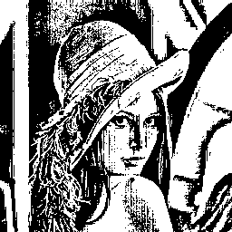

# stb-image-djvul

DjVu Layered - image bundle on the mask + foreground + background using "Multi-scale binarization".

Degradation of images on layers mask, foreground and background by cluster analysis with a gradual decrease in block size.

## build

### load submodules

submodules:

- [stb](https://github.com/nothings/stb.git) -> [src/stb](src/stb)

```shell
$ git submodule init
$ git submodule update
```

### install dependencies

build dependencies:

- build-essential
- cmake

```shell
$ sudo apt-get install build-essential cmake
```

### compilation
```shell
$ mkdir build
$ cd build
$ cmake ..
$ make
```
## use

The first parameter specifies the path to the image. The second parameter is the resulting BW mask. [optional: The third parameter is the background. The fourth parameter is foreground.]

```shell
./stbdjvul [options] image_in bw_mask_out.png [bg_out.png] [fg_out.png]
```

## structure

- `dependencies.c` - API [stb](https://github.com/nothings/stb.git)
- `djvul.h` - DjVuL algoritm
- `stb/` - [stb](https://github.com/nothings/stb.git)
- `stbdjvul.c` - CLI program.

## DjVu Layered

  

```shell
./stbdjvul lena.png lena.mask.png lena.bg.png lena.fg.png
Load: lena.png
image: 256x256:3
BG: 86x86:3
FG: 43x43:3
DjVuL... 7 level
Save png: lena.mask.png, lena.bg.png, lena.fg.png.
```

  

```shell
./stbdjvul -c 1 lena.png lena.mask.c1.png lena.bg.c1.png lena.fg.c1.png 
Load: lena.png
image: 256x256:3
BG: 86x86:3
FG: 43x43:3
DjVuL... 7 level
Save png: lena.mask.c1.png, lena.bg.c1.png, lena.fg.c1.png.
```

  

### DjVu Layered ground

This utility includes a mode for splitting an image into a BG and a FG based on an existing mask (ground). The mask can be corrected.

```shell
./stbdjvul -m 1 -r lena.png lena.mask.png lena.bg.g.png lena.fg.g.png 
Load: lena.png
image: 256x256:3
Load: lena.mask.png
mask: 256x256:3
BG: 86x86:3
FG: 43x43:3
DjVuL ground... 7 level
Save png: lena.mask.png, lena.bg.g.png, lena.fg.g.png.
```

 -rewrite->   

### DjVu Layered reconstruct

This utility includes a mode for reconstruct an image on an existing mask, BG and FG (reconstruct).

```shell
./stbdjvul -m 2 lena.r.png lena.mask.png lena.bg.png lena.fg.png 
Load: lena.mask.png
mask: 256x256:3
Load: lena.bg.png
BG: 86x86:3
Load: lena.fg.png
FG: 43x43:3
DjVuL reconstruct... 2 level
Save png: lena.r.png.
```


---

See [demo of stbDjVuL](https://github.com/ImageProcessing-ElectronicPublications/stb-image-djvul-demo).
