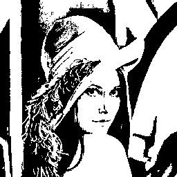

# stb-image-djvul

DjVu Layered - image bundle on the mask + foreground + background using "Multi-scale binarization".

Degradation of images on layers mask, foreground and background by cluster analysis with a gradual decrease in block size.

## build

### load submodules

submodules:
- [stb](https://github.com/nothings/stb.git) -> [src/stb](src/stb)

```shell
$ git submodule update
```

### install dependencies

build dependencies:

- build-essential
- cmake

```shell
$ sudo apt-get install build-essential cmake
```

### compilation
```shell
$ mkdir build
$ cd build
$ cmake ..
$ make
```
## use

The first and second parameters specify the paths to the image and the result {PNG}. The third parameter specifies the scale of the image. The fourth specifies the scaling method {0 - bicubic, 1 - biakima}.
```shell
./stbresize $IMAGE_PATH $BWMASK_out.png $FG_out.png $FB_out.png
```

## structure

- `djvul.h` - DjVuL algoritm
- `image-stb.h` - API [stb](https://github.com/nothings/stb.git)
- `stb/` - [stb](https://github.com/nothings/stb.git)
- `stbdjvul.c` - CLI program.

## DjVu Layered

```shell
./stbdjvul lena.png lena.mask.png lena.fg.png lena.bg.png 
Load: lena.png
image: 256x256:3
BG,FG: 86x86:3
DjVuL...
Save png: lena.mask.png, lena.fg.png, lena.bg.png
```

  
  
